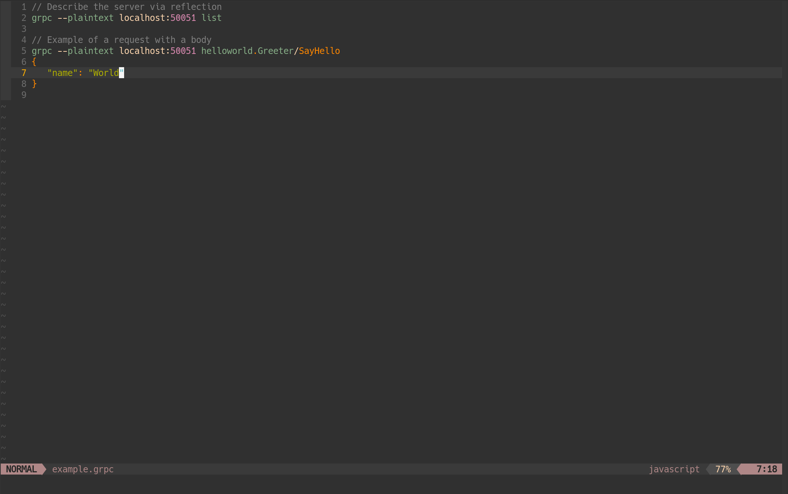

# grpc-nvim

A GRPC client built using [grpcurl](https://github.com/fullstorydev/grpcurl).



---

## Install

### Dependencies
- [grpcurl](https://github.com/fullstorydev/grpcurl) on system path.
- [plenary.nvim](https://github.com/nvim-lua/plenary.nvim)

### Using packer.nvim

```lua
use {
  "hudclark/grpc-nvim",
  requires = { "nvim-lua/plenary.nvim" }
}
```

## Usage

Place your cursor over a valid GRPC request, then `:Grpc`. Results will be shown in a split.

Valid GRPC requests are blocks that start with the pattern `^grpc `. Some examples are as follows:
```proto
// Describe the server via reflection
grpc localhost:50051 list

// Send a request over plaintext.
grpc --plaintext localhost:50051 helloworld.Greeter/SayHello
{
  "name": "Hudclark"
}
```
